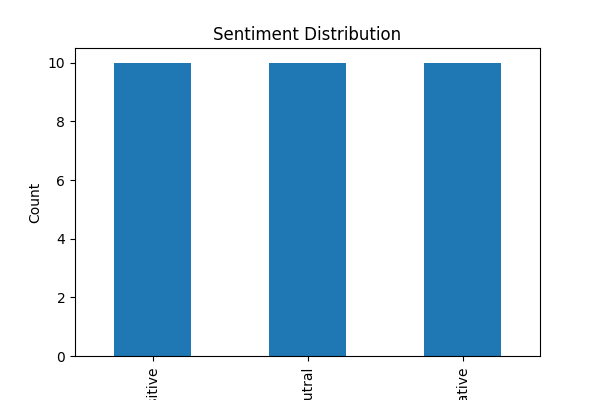

# Customer Feedback Sentiment Analysis using NLP

## Project Overview

This project demonstrates the basics of Natural Language Processing (NLP) by analyzing customer feedback data. The goal is to preprocess textual data, visualize feedback patterns, and build a machine learning model for sentiment classification.

---

## Objectives

- Perform text preprocessing
- Remove stopwords and punctuation
- Apply tokenization and stemming
- Convert text into numerical features using TF-IDF
- Generate visualizations
- Train a sentiment classification model
- Evaluate model performance

---

## Dataset

Dataset Name: coretech_feedback.csv

### Features

| Column Name | Description |
|------------|-------------|
| Feedback_ID | Unique feedback identifier |
| Client_Name | Customer name |
| Service | Service category |
| Feedback_Text | Customer review text |
| Rating | Customer rating |
| Sentiment | Positive, Neutral, Negative |

Total Records: 30

---

## Technologies Used

- Python
- Pandas
- NumPy
- NLTK
- Matplotlib
- WordCloud
- Scikit-Learn

---

## Project Workflow

### Step 1: Import Libraries

Imported all required libraries for NLP, visualization, and machine learning.

### Step 2: Download NLTK Resources

Downloaded:
- punkt
- stopwords

### Step 3: Load Dataset

Loaded customer feedback dataset using Pandas.

### Step 4: Data Exploration

Performed:
- Dataset inspection
- Shape analysis
- Missing value check
- Sentiment distribution analysis

### Step 5: Text Preprocessing

Applied:
- Lowercasing
- Punctuation removal
- Stopword removal
- Stemming

### Step 6: Tokenization

Converted cleaned text into tokens.

### Step 7: TF-IDF Vectorization

Converted text data into numerical vectors suitable for machine learning.

### Step 8: Sentiment Visualization

Generated sentiment distribution bar chart.

### Step 9: Word Cloud Generation

Created word cloud showing the most frequent words in customer feedback.

### Step 10: Train-Test Split

Split data into training and testing datasets.

### Step 11: Model Training

Trained a Multinomial Naive Bayes classifier.

### Step 12: Model Evaluation

Evaluated model performance using accuracy score.

---

## Output Visualizations

### Sentiment Distribution

### Word Cloud

---

## Machine Learning Model

Algorithm Used:

- Multinomial Naive Bayes

Why Chosen:

- Efficient for text classification
- Works well with TF-IDF features
- Simple and fast implementation

---

## Results

- Successfully cleaned and processed text data
- Generated meaningful visualizations
- Built a sentiment classification model
- Achieved sentiment prediction on customer feedback

---

## Folder Structure

Task-7-NLP-Basics/

├── coretech_feedback.csv

├── task7.ipynb

├── sentiment_distribution.png

├── wordcloud.png

└── README.md

---

## Future Improvements

- Use larger datasets
- Apply lemmatization instead of stemming
- Compare multiple classification algorithms
- Build a web-based sentiment analysis dashboard

---

## Conclusion

This project successfully demonstrates fundamental NLP techniques including text preprocessing, tokenization, TF-IDF vectorization, visualization, and sentiment classification using the Naive Bayes algorithm. The results show how NLP can be used to extract insights from customer feedback data.

---

## Intern

Anoosha Sadar
